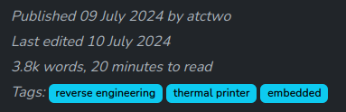

# atctheme

This is a Bootstrap-based Jekyll theme that I designed for use with [my website](atctwo.net).  I've published it on GitHub in case anyone else wants to use it, or is curious how it works.

More details on how the theme was made can be found on [this post](https://atctwo.net/posts/2023/05/18/new-site.html) on my website.

# Pagination

This theme is designed to be used with a paginator (either [jekyll-paginate](https://github.com/jekyll/jekyll-paginate) or [jekyll-paginate-v2](https://github.com/sverrirs/jekyll-paginate-v2)).

To use v1, just add `paginate: <posts per page>` to your `_config.yml`.  The paginator options are detailed on [Jekyll's website](https://jekyllrb.com/docs/pagination/).

If you're using v2, there are [a lot more options](https://github.com/sverrirs/jekyll-paginate-v2/blob/master/README-GENERATOR.md) you can set.  Check out atctwo.net's _config.yml to get an idea of what I used.

# Front Matter options
This theme implements a number of optional custom front matter options to facilitate some interesting features.

### `edit_date`
This can be added to posts to show when the post was last edited.  It takes in a date, and results in the top of a post showing the edit date.



### `custom_excerpt`
If this is set to true, it will be up to the page author to determine what gets included in `{{post.excerpt}}`.  By default the first paragraph gets included in the excerpt, but this isn't always ideal.

To use this, add `custom_excerpt: true` and the built-in `excerpt_separator: <!-- excerpt-end -->`.  Wrap whatever you want included in the excerpt with `<!-- excerpt-start -->` and `<!-- excerpt-end -->`.  For example:

```markdown
This won't be in the excerpt

<!-- excerpt-start -->
This will be included in the excerpt
<!-- excerpt-end -->

This won't be in the excerpt either
```

This is [implemented](https://github.com/atctwo/atctheme/blob/main/_includes/posts.html#L28-L33) using a Liquid snippet adapted from [an article by Chris Shelton](https://cjshelton.github.io/blog/2019/05/27/customising-jekyll-excerpt-start.html).